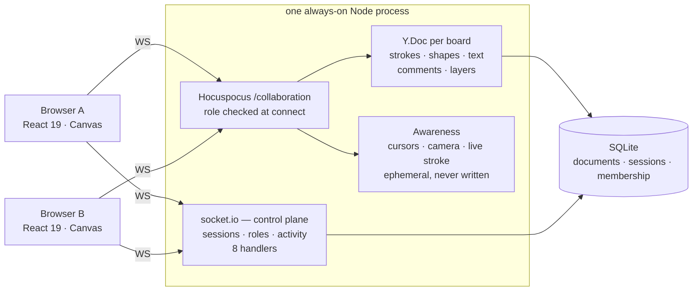

A collaborative whiteboard whose board is a CRDT: two people draw on it at once, edits made
while offline merge back in on reconnect, and the whole board is still there after you kill the
server process.


*One continuous 22.7 s take, recorded from the creator's window while a second browser drives the
other side over a real socket. Someone joins · their cursor moves · their stroke draws as it
happens · a rough shape snaps to a clean circle · a comment is left and resolved. Nothing staged,
nothing sped up — re-record the take with `node benchmarks/record-demo.cjs`, which writes a
`.webm`. The webm→gif conversion was done by hand and no converter is committed, so this exact
file is not reproducible from the repository alone.*

```bash
git clone https://github.com/br9704/collab-dashboard && cd collab-dashboard
npm install && npm run dev        # backend :3001, frontend :5173 — no .env needed
```

| | Measured | Receipt |
|---|---|---|
| End-to-end sync, p50 | **7 ms** LAN · 8 ms loopback, n=30 | [`benchmarks/sync-latency.cjs`](benchmarks/sync-latency.cjs) |
| The board survives a real `pkill` | **1,670 px** of ink restored into a browser with an empty cache | [`benchmarks/persistence.cjs`](benchmarks/persistence.cjs) |
| Tests | **95**, green on GitHub | [ci.yml](.github/workflows/ci.yml) |
| Client events emitted into the void | **0**, down from 13 | [API.md](API.md) |

There is **no live URL** — nothing is deployed yet. See [Status](#status).

[](https://github.com/br9704/collab-dashboard/actions/workflows/ci.yml)
[](LICENSE)


---

## What it does

Everything durable about a board — strokes, shapes, text, layers, comments — lives in a Yjs
document served by Hocuspocus and written to SQLite. That is what makes the board outlive both the
people on it and the process serving it: kill the server, start a new one, reopen the id, and the
ink is still there. It is also what makes two people editing the same text box merge instead of
overwriting each other, and what lets someone keep drawing with the network pulled and reconcile
cleanly when it comes back.

Presence is the opposite kind of state and gets the opposite treatment. Cursors, camera position
and the stroke currently under someone's pen ride the Awareness protocol — broadcast, never
written to disk. Presence answers *who is here now*; persisting it would only mean restoring
ghosts.

Roles are enforced at the document connection rather than in the interface. This matters more
than it sounds: in a CRDT every connected client holds a writable handle on the shared type, so
hiding the toolbar from a viewer is decoration. A viewer here gets a read-only connection, and a
viewer that skips the UI entirely and writes straight into the document over the wire is refused
by the server — which is exactly how the test for it is written.

The shape recogniser is 588 lines of geometry — corner detection, closure, convexity, roundness —
that snaps a rough stroke to a clean rectangle, circle, line, triangle, diamond or arrow. It was
once described in this repo as "AI shape completion". It is not machine learning, it never was,
and it is more interesting described accurately. The motion system is built on the observation
that on a shared whiteboard most movement on screen is other people: remote cursors ease on a
time-based curve, remote strokes *draw* as their points stream in, and your own ink is painted
before any document write. The entire latency budget is spent on remote smoothness and none of it
on local.

## Architecture



Two decisions shaped this. The first was **Yjs over Redis or Postgres** for the document: a CRDT
answers persistence, conflict resolution and offline editing with one move rather than three, and
it is what production whiteboards actually use. The cost is a modelling discipline that is easy to
get wrong — a stroke is inserted as *one* operation holding an immutable point array, never one
operation per point, or a minute of drawing produces thousands of operations and the document can
never be compacted. That rule is a test, not a comment.

The second was **keeping roles out of the CRDT**. Anything inside the document is writable by
anyone who can write to the document, including their own role. Roles therefore live in SQLite
behind socket.io, and the Hocuspocus connection consults them before it hands over a writable
document. Both protocols share one port and one process, because the free tier that would host
this gives you exactly one always-on process — and serverless cannot host it at all, since a
collaborative session *is* a long-lived WebSocket. The full contract is in [API.md](API.md).

```
collab-backend/          Express 5 · Socket.io · Hocuspocus 4
  server.js              control plane: sessions, roles, activity, /health
  collab-doc.js          Yjs document server + connection-level permissions
  store.js               SQLite: sessions and membership
  roles.js               role hierarchy + permission matrix
collab-frontend/         React 19 · Vite 7 · Canvas
  src/collab/            document model + stable browser identity
  src/hooks/             useSocket, useSessionState, useCollabDoc
  src/styles/signal.css  the whole design system, in one file
benchmarks/              the acceptance gates and the latency harness
```

## How it was built

The work started from an audit ([RESEARCH-CONTEXT.md](RESEARCH-CONTEXT.md)) that ran the app
rather than reading it, and found the product did not work at all. Clicking **New Session**
assigned you the role `VIEWER` on the board you had just created, so you could not draw on your
own whiteboard. Presence read `ONLINE (0)` while the socket reported connected at a 2 ms ping.
All state was `const sessions = new Map()`, deleted outright when the last user left — under a
boot banner that headlined *"Persistence"*. There were 40 markdown files, 14 of them reports on
testing — ten `TEST_REPORT_*` and four `VERIFICATION_REPORT_*` — against zero tests.

The two headline blockers turned out to be **one race condition**. The client subscribed to
socket events only after the server had already broadcast the joined-user message, so the only
packet carrying roles and presence arrived before anyone was listening — and the acknowledgement
the client *did* receive already contained the correct answer and was being discarded. Seeding
state from the ack removed the race by construction. Repairing that exposed the bugs underneath
it: `cursor-move` was never emitted by the application at all; the session id was truncated in the
one place it was displayed, so nobody could ever join a board; the canvas bitmap was sized from
the window rather than its own box, so ink landed offset from the pointer; and the canvas measured
1440 px wide inside an 870 px visible area, so you could draw where you could not see.

Then measurement started changing the product rather than describing it. Writing the first tests
found **seven real bugs**, of which the sharpest was inverted corner detection — a 48-point
rectangle scored 46 corners, which meant rectangle, triangle and diamond recognition could never
fire on a hand-drawn stroke. Recording the demo found another: a hand-drawn zigzag was silently
replaced by a straight line, because straightness was measured locally and a smooth wave is
locally straight everywhere. `tryLine` now measures global straightness, and auto-keep is gated at
0.85 confidence — below it, doing nothing keeps *your* stroke, because silence should never cost
a user their work. The sprint-by-sprint record, including every gate and every deferral with its
reason, is in [masterplan.md](masterplan.md).

**Provenance:** most of this repository was written by coding agents under my direction. The
commit history was reattributed to a single author in Sprint 8 with author dates preserved and the
working tree byte-identical before and after; `git log` now shows one author across all 55
commits.

## Results and evidence

**Sync latency** — the time from one person finishing a stroke to that element being present in
someone else's document. The CRDT update, the server relay, the remote apply and the render are
all inside the number; it is deliberately *not* a socket ping, which measures the transport and
says nothing about the product.

| Environment | p50 | p95 | p99 | Samples |
|---|---|---|---|---|
| Loopback | **8 ms** | 9 ms | 9 ms | 30 |
| LAN over Wi-Fi | **7 ms** | 16 ms | 17 ms | 30 |

> **Both browsers run on one machine.** The LAN row exercises the real network stack rather than
> the loopback interface, but it is not two physical devices, and nothing is deployed, so there is
> no internet figure. Over a real connection the number will be dominated by round-trip time to
> the server. It will be measured when there is something to measure — not estimated first.

Method, and a fuller list of what these numbers do not say, in
[`benchmarks/README.md`](benchmarks/README.md). Reproduce with `node benchmarks/sync-latency.cjs`.

**95 unit and integration tests**, run in CI on every push:

| Suite | Covers |
|---|---|
| [`roles.test.mjs`](collab-backend/roles.test.mjs) | the permission matrix as properties — hierarchy holds, unknown input fails closed |
| [`store.test.mjs`](collab-backend/store.test.mjs) | durable membership, against a real SQLite file reopened to simulate a restart |
| [`session.integration.test.mjs`](collab-backend/session.integration.test.mjs) | the real server over a real socket; pins the original race |
| [`permissions.test.js`](collab-frontend/src/utils/permissions.test.js) | the client-side permission model |
| [`shapeRecognition.test.js`](collab-frontend/src/utils/shapeRecognition.test.js) | the geometry, on clean *and* hand-wobbled shapes |
| [`doc.test.js`](collab-frontend/src/collab/doc.test.js) | the CRDT modelling rules and convergence under concurrent edits |

Six browser-level acceptance gates live in [`benchmarks/`](benchmarks/), alongside the latency
harness and the demo recorder. They are run by hand, because they need Playwright and a running
stack: two-window collaboration (15 checks), persistence across an actual process kill (9), the
CRDT permission boundary driven at the wire with no UI involved (9), feature round-trips (11), the
[MOTION.md](MOTION.md) checklist (12), and offline reconciliation (8).

## Usage

```console
$ npm start                     # the backend alone; npm run dev starts it with the frontend
[SERVER]  Listening on 0.0.0.0:3001
[DOC]     Yjs/Hocuspocus at /collaboration
[STORE]   SQLite at …/collab-backend/data/collab.sqlite — sessions and documents survive restart
[CORS]    http://localhost:5173, http://localhost:3000
[HEALTH]  GET /health

$ curl -s localhost:3001/health
{"status":"ok","uptime":3,"sessions":0,"documents":0,"connections":0,"persistence":"sqlite"}

$ npm test
 Test Files  3 passed (3)      # collab-backend
      Tests  32 passed (32)
 Test Files  3 passed (3)      # collab-frontend
      Tests  63 passed (63)
```

Open the app, click **New Session**, copy the session id, and paste it into a second browser
window to join the same board.

Moving the app to another machine takes one variable. The rest have defaults that run locally
with no `.env` at all:

| Variable | Side | Default | Notes |
|---|---|---|---|
| `VITE_SOCKET_URL` | frontend, build time | `http://localhost:3001` | The document URL is derived from it, `ws://` → `wss://` included |
| `CORS_ORIGIN` | backend | the two localhost dev origins | Comma-separated; enforced on both the HTTP and socket.io surfaces |
| `PORT` / `HOST` | backend | `3001` / `0.0.0.0` | Binds externally by default, because container health checks cannot reach loopback |
| `DATABASE_PATH` | backend | `collab-backend/data/collab.sqlite` | Must sit on a mounted volume in production |

Moving the app off localhost takes only those variables — verified across a LAN with no source
edit. [DEPLOYMENT.md](DEPLOYMENT.md) has the rest, including the two mistakes that silently lose
every board.

## Limitations

| Limit | Detail |
|---|---|
| **Not deployed** | No live URL and no internet latency figure. The runbook is written ([docs/RELEASE.md](docs/RELEASE.md)); it needs the owner's hosting accounts |
| **Measured on one machine** | Every figure above has both browsers on the same laptop |
| **One process only** | Documents live in the memory of the process serving them; horizontal scaling needs Redis pub/sub and Postgres, and running two machines today would let boards silently diverge |
| **No authentication** | The client id identifies a *browser*, not a person. Anyone with a session id can open that board as a viewer |
| **Offline caches the document, not the app shell** | There is no service worker, so reloading the page while offline still fails at the network |
| **Synchronised camera is unfinished** | Peers publish their camera over Awareness and nothing consumes it |
| **Acceptance gates are not in CI** | The browser harnesses in `benchmarks/` need a browser image and a compose step; CI runs the 95 unit and integration tests plus a health check against a real process |

## Status

Nine sprints, all closed on a gate with recorded evidence: the core journey, persistence, feature
completion, the design and motion system, tests and CI, deploy readiness, the demo, and the
owner-gated work. CI is green on GitHub.

The bar this project set itself was *two people on different machines open a URL and draw
together, and the state survives a server restart*. Half of that is met and verified — the state
survives an actual process kill, and two people do draw together, including over a LAN against a
non-localhost backend with only environment variables changed. The other half is not: nothing is
deployed, so there is no URL and no two-machine measurement.

Three items remain, each with its exact command in [docs/RELEASE.md](docs/RELEASE.md): deploy the
backend to Fly, deploy the frontend to Vercel, and measure sync latency against the deployment.
Until that last one produces a number, the "50–80 ms sync" line in my portfolio copy stays
unpublished — it is not contradicted by anything measured here, it is simply about a deployment
that does not exist.

## License · Author

MIT — see [LICENSE](LICENSE).

Bruno Jaamaa — [brunojaamaa.dev](https://brunojaamaa.dev) · [github.com/br9704](https://github.com/br9704)
